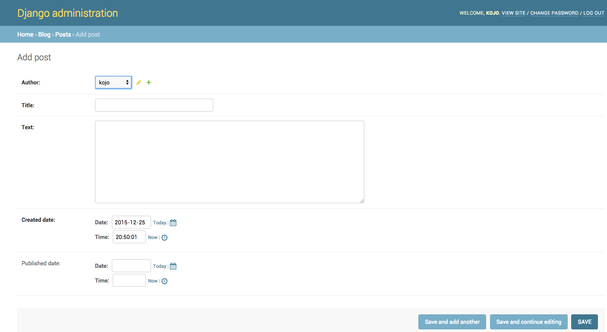

# Django Admin

Para adicionar, editar e deletar os posts que acabamos de modelar, nós usaremos o admin do Django.

Vamos abrir o arquivo `blog/admin.py` no editor de código e substituir o conteúdo pelo seguinte:

blog/admin.py

```python
from django.contrib import admin
from .models import Post

admin.site.register(Post)
```

Como você pode ver, nós importamos (incluímos) o modelo Post definido no capítulo anterior. Para tornar nosso modelo visível na página de administração, precisamos registrá-lo com `admin.site.register(Post)`.

OK, hora de olhar para o nosso modelo de Post. Lembre-se de executar `python manage.py runserver` no console para iniciar o servidor web. Vá para o seu navegador e digite o endereço http://127.0.0.1:8000/admin/. Você verá uma página de login como essa:


Para fazer login, você precisa criar um *superusuário (superuser)* - uma conta de usuário que pode controlar tudo no site. Volte à linha de comando, digite `python manage.py createsuperuser` e aperte Enter.

> Lembre-se: para escrever novos comandos enquanto o servidor web estiver rodando, abra uma nova janela do terminal e ative seu virtualenv. Nós revisamos como escrever novos comandos no capítulo **Seu primeiro projeto Django!**, na seção **Iniciando o servidor web**.

Mac OS X ou Linux:

    (myvenv) ~/djangogirls$ python manage.py createsuperuser


Windows:

    (myvenv) C:\Users\Name\djangogirls> python manage.py createsuperuser


Quando for solicitado, insira seu nome de usuário (letras minúsculas, sem espaços), e-mail e senha. **Não se preocupe por não conseguir ver a senha que está digitando - é assim mesmo.** Digite a senha e aperte a tecla `enter` para continuar. A saída deve parecer com isso (onde o nome de usuário e o email devem ser os seus):

    Username: ola
    Email address: ola@example.com
    Password:
    Password (again):
    Superuser created successfully.


Volte ao seu navegador. Faça login com as credenciais de superusuário que você escolheu; você deverá ver o painel de controle de administração do Django.


Vá para as postagens e experimente um pouco com elas. Adicione cinco ou seis postagens. Não se preocupe com o conteúdo -- ele só é visível para você no seu computador local -- você pode copiar e colar algum texto deste tutorial para economizar tempo. :)

Certifique-se de que pelo menos duas ou três postagens (mas não todas) têm a data de publicação definida. Isso será útil depois.



Se você quiser saber mais sobre o Django admin, confira a documentação do Django: https://docs.djangoproject.com/en/2.0/ref/contrib/admin/

Esse provavelmente é um bom momento para pegar um café (ou chá) ou algo para comer para recuperar as energias. Você criou seu primeiro modelo em Django e merece uma pausa!